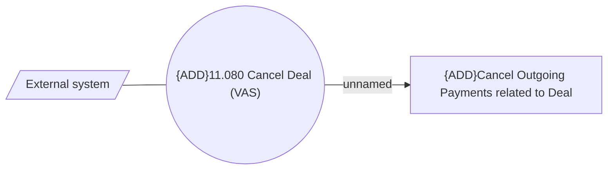

# VAS - Cancel Deal method update - cancel out payment

- **Diagram Type**: Use Case
- **Package**: HomerSelect/BSL/Requirements Model/Finished/CSI/CBL-22680 Service Management Modules for REL (KZ)/CSI-3061	VAS - Cancel Deal method update - cancel out payment
- **Diagram ID**: 155513
- **Elements**: 3
- **Connectors**: 2

