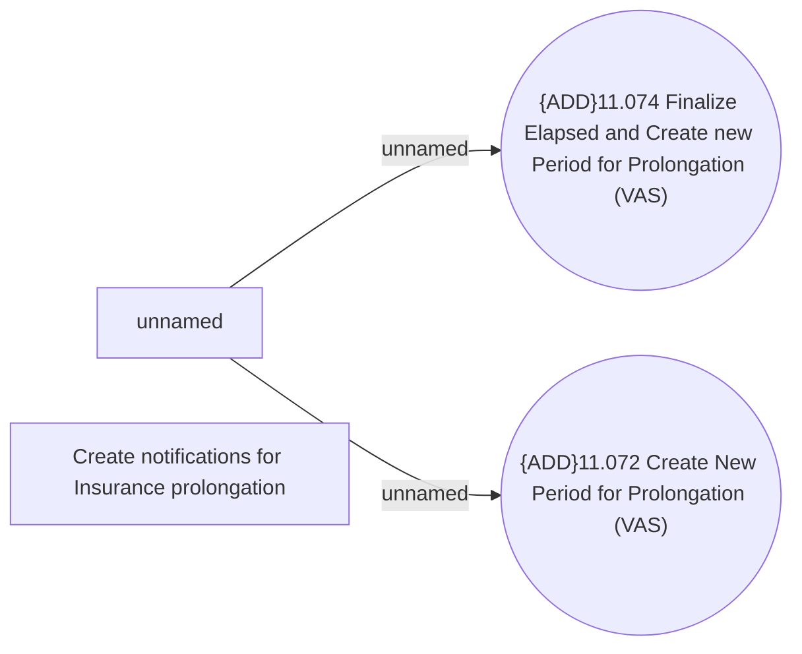

# VAS - Deal (Insurance) Prolongation notification

- **Diagram Type**: Use Case
- **Package**: HomerSelect/BSL/Requirements Model/Finished/CSI/CBL-22680 Service Management Modules for REL (KZ)/CSI-3088 VAS - Deal (Insurance) Prolongation notification
- **Diagram ID**: 155809
- **Elements**: 6
- **Connectors**: 2

