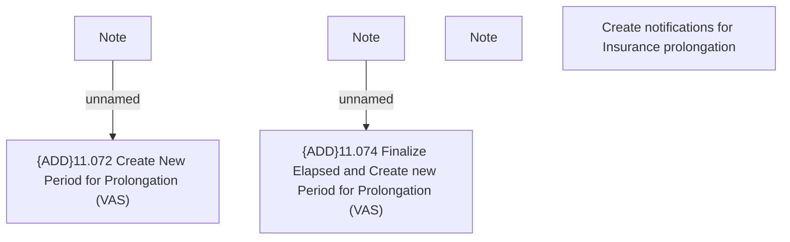

# VAS - Deal (Insurance) Prolongation notification

```mermaid
graph TD
    el_1796849["Note"]
    el_1796850["Note"]
    ADD_11_072_Create_New_Period_for_Prolongation_VAS["{ADD}11.072 Create New Period for Prolongation (VAS)"]
    ADD_11_074_Finalize_Elapsed_and_Create_new_Period_for_Prolon["{ADD}11.074 Finalize Elapsed and Create new Period for Prolongation (VAS)"]
    el_1796852["Note"]
    Create_notifications_for_Insurance_prolongation["Create notifications for Insurance prolongation"]
    el_1796850 -->|unnamed| ADD_11_074_Finalize_Elapsed_and_Create_new_Period_for_Prolon
    el_1796849 -->|unnamed| ADD_11_072_Create_New_Period_for_Prolongation_VAS
```
