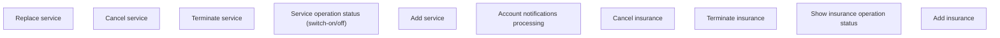

# KZ BSL integration - use cases

```mermaid
graph TD
    Replace_service["Replace service"]
    Cancel_service["Cancel service"]
    Terminate_service["Terminate service"]
    Service_operation_status_switch_on_off["Service operation status (switch-on/off)"]
    Add_service["Add service"]
    Account_notifications_processing["Account notifications processing"]
    Cancel_insurance["Cancel insurance"]
    Terminate_insurance["Terminate insurance"]
    Show_insurance_operation_status["Show insurance operation status"]
    Add_insurance["Add insurance"]
```
