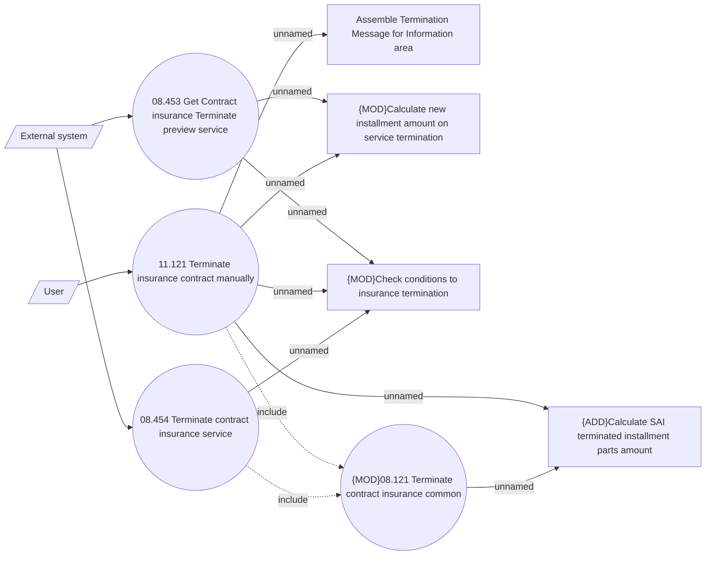

# CLM-5981 Termination of the SAI with installments

- **Diagram Type**: Use Case
- **Package**: HomerSelect/BSL/Requirements Model/In process/CLM/CBL-23168 (CLM-5891) [VAS] Standalone PPI as a second loan/CLM-5981 Termination of the SAI with installments
- **Diagram ID**: 156647
- **Elements**: 10
- **Connectors**: 13

