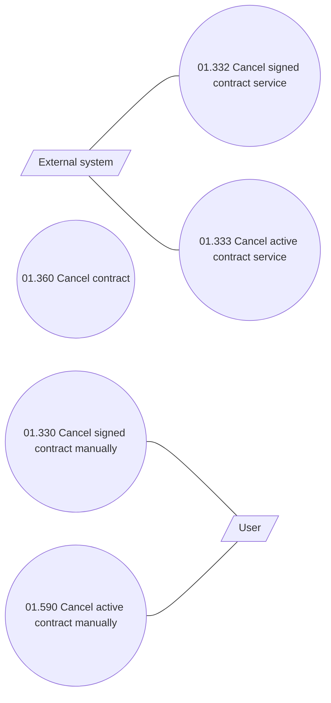

# CLM-6021 Cancellation of SAI with installments

- **Diagram Type**: Use Case
- **Package**: HomerSelect/BSL/Requirements Model/In process/CLM/CBL-23168 (CLM-5891) [VAS] Standalone PPI as a second loan/CLM-6021 Cancellation of SAI with installments
- **Diagram ID**: 156582
- **Elements**: 7
- **Connectors**: 4

