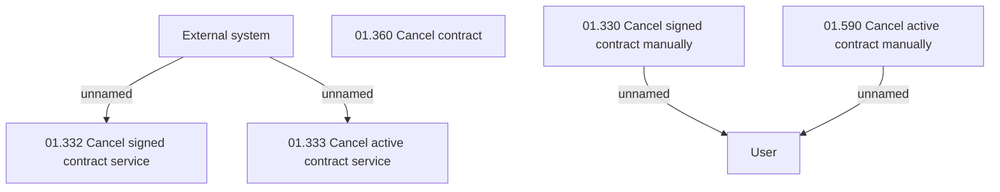

# CLM-6021 Cancellation of SAI with installments

```mermaid
graph TD
    External_system["External system"]
    n_01_360_Cancel_contract["01.360 Cancel contract"]
    User["User"]
    n_01_333_Cancel_active_contract_service["01.333 Cancel active contract service"]
    n_01_590_Cancel_active_contract_manually["01.590 Cancel active contract manually"]
    n_01_332_Cancel_signed_contract_service["01.332 Cancel signed contract service"]
    n_01_330_Cancel_signed_contract_manually["01.330 Cancel signed contract manually"]
    n_01_330_Cancel_signed_contract_manually -->|unnamed| User
    n_01_590_Cancel_active_contract_manually -->|unnamed| User
    External_system -->|unnamed| n_01_332_Cancel_signed_contract_service
    External_system -->|unnamed| n_01_333_Cancel_active_contract_service
```
