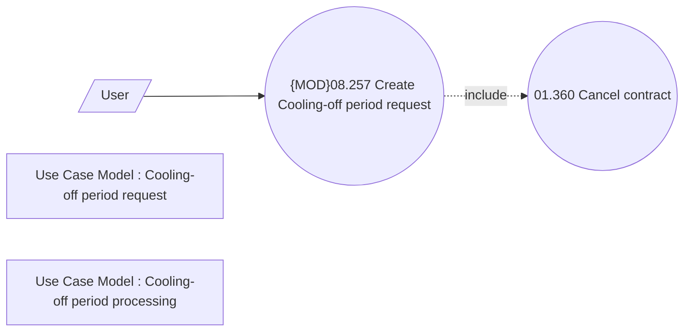

# CLM-6027 Update COP processing for Standalone PPI

- **Diagram Type**: Use Case
- **Package**: HomerSelect/BSL/Requirements Model/In process/CLM/CBL-23168 (CLM-5891) [VAS] Standalone PPI as a second loan/CLM-6027 Update COP processing for Standalone PPI
- **Diagram ID**: 156634
- **Elements**: 5
- **Connectors**: 2

