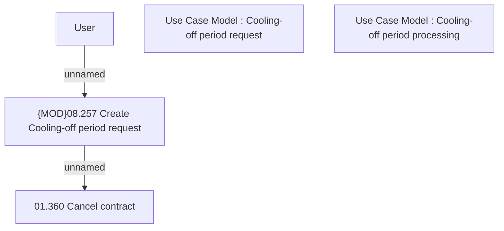

# CLM-6027 Update COP processing for Standalone PPI

```mermaid
graph TD
    n_01_360_Cancel_contract["01.360 Cancel contract"]
    User["User"]
    MOD_08_257_Create_Cooling_off_period_request["{MOD}08.257 Create Cooling-off period request"]
    Use_Case_Model_Cooling_off_period_request["Use Case Model : Cooling-off period request"]
    Use_Case_Model_Cooling_off_period_processing["Use Case Model : Cooling-off period processing"]
    User -->|unnamed| MOD_08_257_Create_Cooling_off_period_request
    MOD_08_257_Create_Cooling_off_period_request -->|unnamed| n_01_360_Cancel_contract
```
