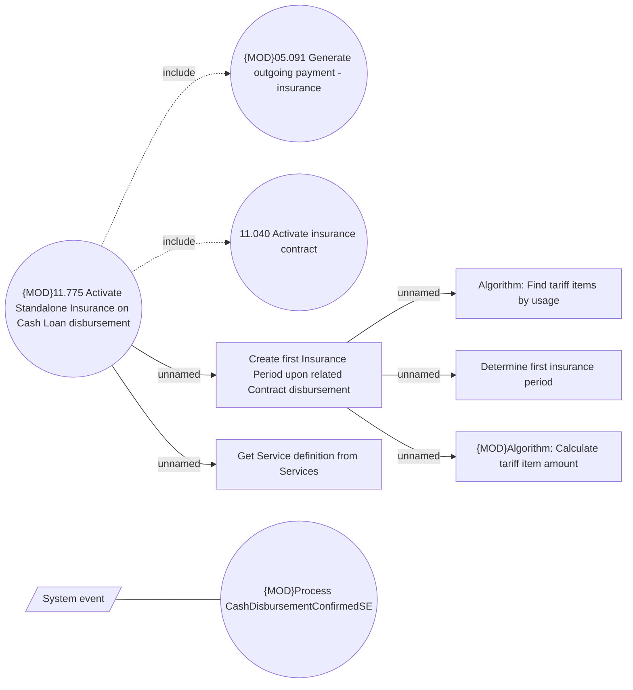

# CLM-6044 Activate Insurance on related CL Contract disbursement

- **Diagram Type**: Use Case
- **Package**: HomerSelect/BSL/Requirements Model/In process/CLM/CBL-23420 (CLM-5952) [VAS] Standalone PPI as a second loan_Prior 2/CLM-6044 Activate Insurance on related CL Contract disbursement
- **Diagram ID**: 156877
- **Elements**: 10
- **Connectors**: 8

