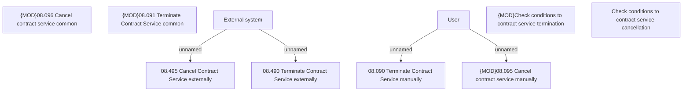

# CLM-6072 Cancel/Terminate Service update for SAI

```mermaid
graph TD
    MOD_08_096_Cancel_contract_service_common["{MOD}08.096 Cancel contract service common"]
    MOD_08_091_Terminate_Contract_Service_common["{MOD}08.091 Terminate Contract Service common"]
    External_system["External system"]
    MOD_08_095_Cancel_contract_service_manually["{MOD}08.095 Cancel contract service manually"]
    User["User"]
    n_08_090_Terminate_Contract_Service_manually["08.090 Terminate Contract Service manually"]
    MOD_Check_conditions_to_contract_service_termination["{MOD}Check conditions to contract service termination"]
    Check_conditions_to_contract_service_cancellation["Check conditions to contract service cancellation"]
    n_08_495_Cancel_Contract_Service_externally["08.495 Cancel Contract Service externally"]
    n_08_490_Terminate_Contract_Service_externally["08.490 Terminate Contract Service externally"]
    External_system -->|unnamed| n_08_495_Cancel_Contract_Service_externally
    User -->|unnamed| n_08_090_Terminate_Contract_Service_manually
    External_system -->|unnamed| n_08_490_Terminate_Contract_Service_externally
    User -->|unnamed| MOD_08_095_Cancel_contract_service_manually
```
