# PAYM-1887 (CBL-4285) - Pairing time for payment made before due date - services alignment

- **Diagram Type**: Use Case
- **Package**: HomerSelect/BSL/Requirements Model/In process/ISPAY/PAYM-1887 (CBL-4285) - Pairing time for payment made before due date - services alignment
- **Diagram ID**: 115183
- **Elements**: 46
- **Connectors**: 37

```mermaid
graph LR
    MOD_08_257_Create_Cooling_off_period_request(("{MOD}08.257 Create Cooling-off period request"))
    n_08_065_Calculate_Cooling_off_period_repayment_preview(("08.065 Calculate Cooling-off period repayment preview"))
    MOD_08_252_Process_cooling_off_period(("{MOD}08.252 Process cooling-off period"))
    unnamed["unnamed"]
    unnamed["unnamed"]
    COP["COP"]
    ODS_add_the_contract_to_PER_processing["ODS - add the contract to PER processing"]
    REQ_2_3_PER_processing_TO_CHECK_WITH_CLM["REQ 2.3 PER processing - TO CHECK WITH CLM"]
    n_08_057_Perform_Partial_early_repayment(("08.057 Perform Partial early repayment"))
    n_08_055_Check_Partial_early_repayment_service(("08.055 Check Partial early repayment service"))
    Change_PER_result["Change PER result"]
    REQ_2_2_PER_request["REQ 2.2 PER request"]
    n_08_053_Create_PER_request_manually(("08.053 Create PER request manually"))
    PER_Result["PER Result"]
    MOD_Check_PER_request_availability["{MOD}Check PER request availability"]
    REQ_2_1_PER_preview["REQ 2.1 PER preview"]
    n_08_050_Show_Partial_ER_preview(("08.050 Show Partial ER preview"))
    MOD_08_220_Check_and_process_Grace_period(("{MOD}08.220 Check and process Grace period"))
    MOD_08_222_Calculate_Grace_period_amount(("{MOD}08.222 Calculate Grace period amount"))
    ER_request["ER request"]
    ER_processing["ER processing"]
    n_03_100_Check_and_process_Early_repayment_request(("03.100 Check and process Early repayment request"))
    n_03_052_Create_Full_Early_repayment_request(("03.052 Create Full Early repayment request"))
    n_08_066_Calculate_Full_Early_repayment_preview(("08.066 Calculate Full Early repayment preview"))
    n_03_050_Create_Full_Early_repayment_request_manually(("03.050 Create Full Early repayment request manually"))
    n_03_035_Show_early_repayment_preview(("03.035 Show early repayment preview"))
    REQ4_Consolidation_check["REQ4: Consolidation check"]
    REQ3_GiftPayment_alignment["REQ3: GiftPayment alignment"]
    REQ2_PER_alignment["REQ2: PER alignment"]
    GRPER["GRPER"]
    FER["FER"]
    ER_request_preview_Early_repayment_preview["ER request preview : Early repayment preview"]
    Early_Repayment_Result["Early Repayment Result"]
    ER_preview["ER preview"]
    MOD_08_280_Check_and_process_CET_request(("{MOD}08.280 Check and process CET request"))
    REQ_1_3_ER_processing["REQ 1.3 ER processing"]
    n_08_271_Create_CET_repayment_request(("08.271 Create CET repayment request"))
    n_08_270_Show_CET_repayment_preview(("08.270 Show CET repayment preview"))
    REQ_1_2_ER_request["REQ 1.2 ER request"]
    REQ_1_1_ER_preview["REQ 1.1 ER preview"]
    REQ1_Services_using_early_repayment_algorithm["REQ1: Services using early repayment algorithm"]
    CET["CET"]
    REQ2["REQ2"]
    unnamed["unnamed"]
    unnamed["unnamed"]
    REQ1["REQ1"]
    Change_PER_result -->|unnamed| n_08_053_Create_PER_request_manually
    REQ_2_3_PER_processing_TO_CHECK_WITH_CLM -->|unnamed| ODS_add_the_contract_to_PER_processing
    ER_processing -->|unnamed| n_03_100_Check_and_process_Early_repayment_request
    ER_processing -->|unnamed| MOD_08_220_Check_and_process_Grace_period
    REQ_2_1_PER_preview -->|unnamed| n_08_050_Show_Partial_ER_preview
    REQ2_PER_alignment --- REQ_2_1_PER_preview
    ER_preview -->|unnamed| n_08_066_Calculate_Full_Early_repayment_preview
    Change_PER_result -->|unnamed| PER_Result
    REQ_2_2_PER_request -->|unnamed| n_08_053_Create_PER_request_manually
    REQ2_PER_alignment --- REQ_2_2_PER_request
    REQ_2_1_PER_preview -->|unnamed| Change_PER_result
    REQ_2_2_PER_request -->|unnamed| Change_PER_result
    ODS_add_the_contract_to_PER_processing -->|unnamed| n_08_055_Check_Partial_early_repayment_service
    ODS_add_the_contract_to_PER_processing -->|unnamed| n_08_057_Perform_Partial_early_repayment
    REQ2_PER_alignment --- REQ_2_3_PER_processing_TO_CHECK_WITH_CLM
    ER_request -->|unnamed| MOD_08_257_Create_Cooling_off_period_request
    ER_preview -->|unnamed| n_08_065_Calculate_Cooling_off_period_repayment_preview
    REQ1_Services_using_early_repayment_algorithm --- REQ_1_1_ER_preview
    REQ1_Services_using_early_repayment_algorithm --- REQ_1_2_ER_request
    REQ_1_1_ER_preview -->|unnamed| n_08_270_Show_CET_repayment_preview
    ER_preview -->|unnamed| n_08_270_Show_CET_repayment_preview
    REQ_1_2_ER_request -->|unnamed| n_08_271_Create_CET_repayment_request
    REQ1_Services_using_early_repayment_algorithm --- REQ_1_3_ER_processing
    ER_processing -->|unnamed| MOD_08_252_Process_cooling_off_period
    ER_processing -->|unnamed| MOD_08_280_Check_and_process_CET_request
    REQ_1_3_ER_processing -->|unnamed| MOD_08_280_Check_and_process_CET_request
    ER_processing -->|unnamed| Early_Repayment_Result
    ER_request -->|unnamed| Early_Repayment_Result
    ER_preview -->|unnamed| ER_request_preview_Early_repayment_preview
    ER_request -->|unnamed| n_03_050_Create_Full_Early_repayment_request_manually
    ER_request -->|unnamed| n_08_271_Create_CET_repayment_request
    n_08_271_Create_CET_repayment_request -.->|include| MOD_08_280_Check_and_process_CET_request
    n_03_050_Create_Full_Early_repayment_request_manually -.->|include| n_03_100_Check_and_process_Early_repayment_request
    n_03_050_Create_Full_Early_repayment_request_manually -.->|extend| n_03_035_Show_early_repayment_preview
    n_03_050_Create_Full_Early_repayment_request_manually -.->|include| n_03_052_Create_Full_Early_repayment_request
    n_03_035_Show_early_repayment_preview -.->|include| n_08_066_Calculate_Full_Early_repayment_preview
    MOD_08_220_Check_and_process_Grace_period -.->|include| MOD_08_222_Calculate_Grace_period_amount
```

