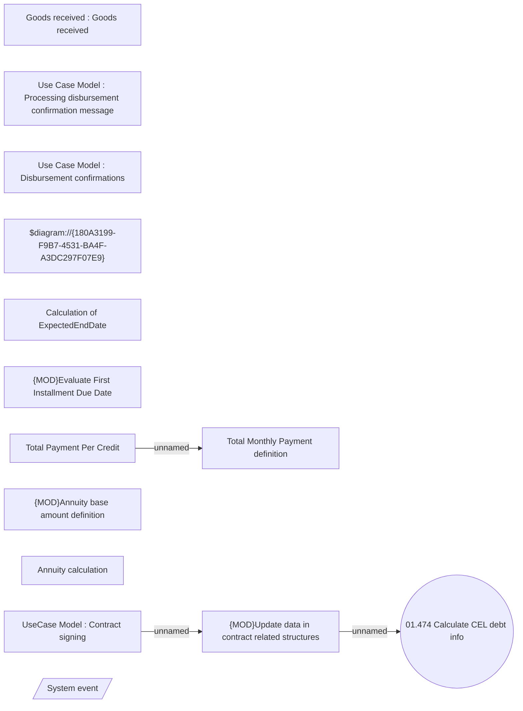

# Determine installment schedule processing

- **Diagram Type**: Use Case
- **Package**: HomerSelect/BSL/Requirements Model/In process/IS/IS-589 (CBL-5864) Generate IS only once a customer picks up goods
- **Diagram ID**: 163536
- **Elements**: 14
- **Connectors**: 3

