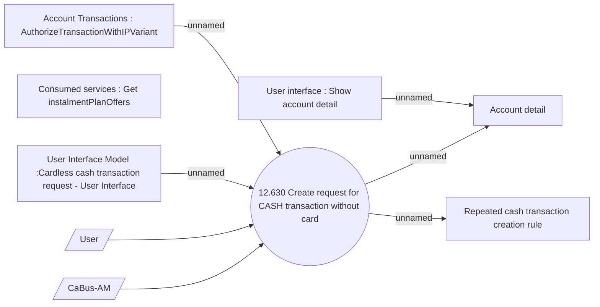

# CSI-2848 KZ - LOP support in BSL update

- **Diagram Type**: Use Case
- **Package**: HomerSelect/BSL/Requirements Model/In process/KZ BSL/CBL-21017 KZ - Suport for DOS card, corporate cards and direct transaction processing with VISA/CSI-2848 KZ - LOP support in BSL update
- **Diagram ID**: 154143
- **Elements**: 9
- **Connectors**: 7

