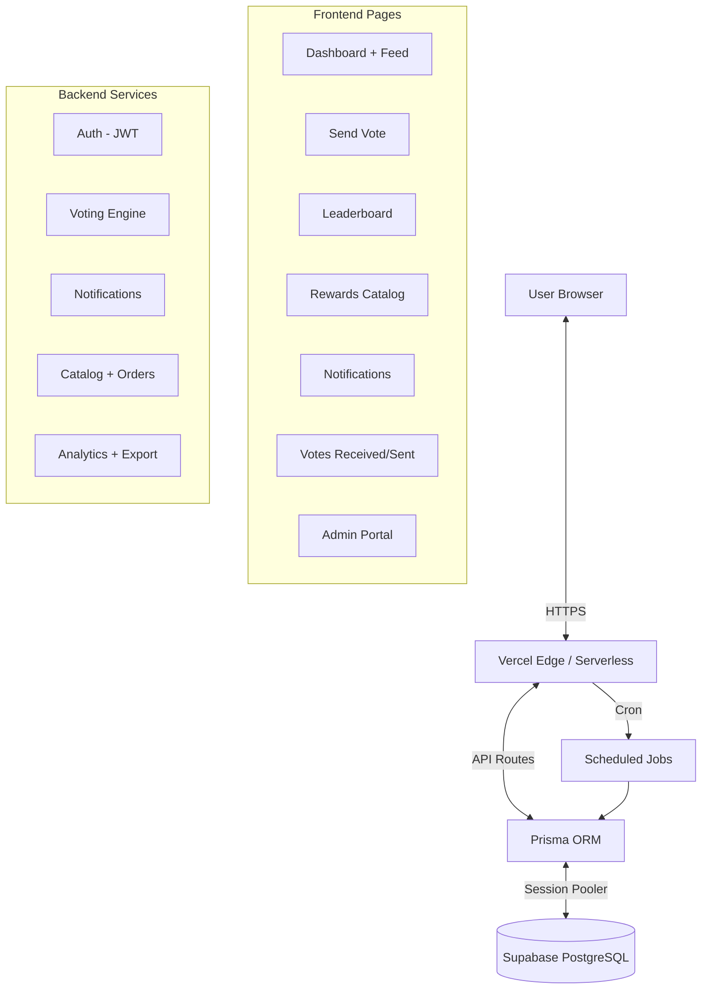

# Software Requirements Specification (SRS)
## Project: EmPulse
**Version:** 2.0 (Production)
**Date:** February 10, 2026

## 1. Introduction
This document defines the technical specifications, architecture, and data models for the EmPulse application.

## 2. Tech Stack
-   **Frontend:** Next.js 16 (App Router), React 19, Custom CSS Variables.
-   **Backend:** Next.js API Routes (Serverless on Vercel).
-   **Database:** PostgreSQL on Supabase (with Prisma ORM).
-   **Authentication:** JWT-based (access + refresh tokens, HttpOnly cookies) with RBAC.
-   **Validation:** Zod schemas for all API inputs.
-   **Hosting:** Vercel (Hobby plan), Supabase (free tier).
-   **Cron Jobs:** Vercel Cron (daily schedule).

## 3. System Architecture
### 3.1 High-Level Diagram

## 4. Data Models (Prisma Schema)

### 4.1 User
| Field | Type | Notes |
|-------|------|-------|
| id | Int (PK) | Auto-increment |
| email | String (unique) | Login credential |
| passwordHash | String | bcrypt hash |
| fullName | String | Display name |
| role | String | admin, hr_admin, manager, employee |
| regionId | Int (FK) | Region reference |
| teamId | Int (FK) | Team reference |
| managerId | Int (FK, nullable) | Direct manager |
| isActive | Boolean | Soft delete flag |

### 4.2 Vote
| Field | Type | Notes |
|-------|------|-------|
| id | Int (PK) | Auto-increment |
| senderId | Int (FK) | Who sent |
| receiverId | Int (FK) | Who received |
| message | String | 20-500 chars |
| pointsAwarded | Int | Points given (default 10) |
| createdAt | DateTime | Timestamp |
| valueTags | VoteValueTag[] | Associated company values |

### 4.3 ValueTag
| Field | Type | Notes |
|-------|------|-------|
| id | Int (PK) | Auto-increment |
| name | String (unique) | e.g., "Helpful", "Innovative" |
| icon | String | Emoji icon |
| isActive | Boolean | Active flag |

### 4.4 VoteValueTag (Junction)
| Field | Type | Notes |
|-------|------|-------|
| voteId | Int (PK, FK) | Vote reference |
| valueTagId | Int (PK, FK) | ValueTag reference |

### 4.5 QuotaWallet
| Field | Type | Notes |
|-------|------|-------|
| id | Int (PK) | Auto-increment |
| userId | Int (FK, unique) | Owner |
| balance | Int | Remaining votes this period |
| periodStart/End | DateTime | Current quota period |

### 4.6 RewardWallet
| Field | Type | Notes |
|-------|------|-------|
| id | Int (PK) | Auto-increment |
| userId | Int (FK, unique) | Owner |
| balance | Int | Redeemable points |
| quarterStart/End | DateTime | Current quarter |

### 4.7 InAppNotification
| Field | Type | Notes |
|-------|------|-------|
| id | Int (PK) | Auto-increment |
| userId | Int (FK) | Recipient |
| type | String | VOTE_RECEIVED, ORDER_APPROVED, ORDER_REJECTED, ORDER_COMPLETED, QUARTERLY_WARNING |
| title | String | Notification title |
| message | String | Notification body |
| isRead | Boolean | Read status |
| metadata | Json (nullable) | Extra data (voteId, orderId, etc.) |
| createdAt | DateTime | Timestamp |

### 4.8 RewardCatalog
| Field | Type | Notes |
|-------|------|-------|
| id | Int (PK) | Auto-increment |
| regionId | Int (FK) | Region-specific |
| name | String | Item name |
| pointsRequired | Int | Cost in points |
| rewardType | String | digital_voucher, physical_item, experience |
| isActive | Boolean | Active flag |

### 4.9 RedemptionOrder
| Field | Type | Notes |
|-------|------|-------|
| id | Int (PK) | Auto-increment |
| userId | Int (FK) | Who ordered |
| catalogId | Int (FK) | What item |
| pointsSpent | Int | Points deducted |
| status | String | PENDING_APPROVAL, APPROVED, REJECTED, COMPLETED |

### 4.10 Supporting Models
- **Region:** Multi-region support (VN, CZ)
- **Team:** Department/team grouping
- **VoteTracking:** Per-person monthly vote limits + cooldown
- **WeeklyVoteTracking:** Weekly vote cap enforcement
- **SystemSetting:** Key-value configuration store
- **AuditLog:** Action audit trail
- **NotificationLog:** Email notification history

## 5. API Endpoints

### 5.1 Auth
| Method | Path | Description |
|--------|------|-------------|
| POST | /api/auth/login | Authenticate, set JWT cookies |
| POST | /api/auth/logout | Clear cookies |
| GET | /api/auth/me | Get current user profile |
| POST | /api/auth/register | Create new account |

### 5.2 Votes
| Method | Path | Description |
|--------|------|-------------|
| GET | /api/votes | Get user's received/sent votes (type param) |
| POST | /api/votes | Send vote with message + optional valueTagIds |
| GET | /api/feed | Public recognition feed (paginated, cached) |

### 5.3 Value Tags
| Method | Path | Description |
|--------|------|-------------|
| GET | /api/value-tags | List active value tags |

### 5.4 Rewards
| Method | Path | Description |
|--------|------|-------------|
| GET | /api/catalog | List catalog items (region-filtered) |
| POST | /api/orders | Create redemption order |
| GET | /api/orders | Get user's order history |
| GET | /api/wallets | Get quota + reward wallet balances |

### 5.5 Social
| Method | Path | Description |
|--------|------|-------------|
| GET | /api/leaderboard | Leaderboard (type: receivers/senders/teams) |
| GET | /api/users | List users (for vote recipient selection) |

### 5.6 Notifications
| Method | Path | Description |
|--------|------|-------------|
| GET | /api/notifications | Get notifications (paginated) |
| PATCH | /api/notifications | Mark read (ids array or markAllRead) |
| GET | /api/notifications/count | Get unread count |

### 5.7 Admin
| Method | Path | Description |
|--------|------|-------------|
| GET | /api/admin/analytics/dashboard | Full analytics payload |
| GET | /api/admin/users | List all users |
| PATCH | /api/admin/users/[id] | Update user |
| GET | /api/admin/orders | List all orders |
| POST | /api/admin/orders/[id]/approve | Approve order |
| POST | /api/admin/orders/[id]/reject | Reject order |
| POST | /api/admin/orders/[id]/complete | Complete order |
| GET | /api/admin/catalog | List catalog items |
| POST | /api/admin/catalog | Create catalog item |
| PATCH | /api/admin/catalog/[id] | Update catalog item |
| GET | /api/admin/settings | Get system settings |
| PATCH | /api/admin/settings | Update settings |
| GET | /api/admin/teams | List teams |
| GET | /api/admin/flagged-votes | List flagged votes |
| GET | /api/admin/export/[type] | CSV export (votes/redemptions/engagement) |

### 5.8 Manager
| Method | Path | Description |
|--------|------|-------------|
| GET | /api/manager/team | Get manager's team members |

### 5.9 Infrastructure
| Method | Path | Description |
|--------|------|-------------|
| GET | /api/health | Health check + DB connectivity |
| GET | /api/ping | Simple uptime check |
| POST | /api/cron/fifo-processor | Daily FIFO order processing |
| POST | /api/cron/quarterly-reset | Quarterly point reset |
| POST | /api/cron/quarterly-warning | Points expiration warnings |
| POST | /api/cron/quota-reset | Monthly quota reset |

## 6. UI/UX Specifications
-   **Theme:** Dark mode default (`#000`, `rgba(255,255,255,0.05)`).
-   **Primary Color:** Neon Green (`#00D264`).
-   **Typography:** Satoshi (Google Fonts).
-   **Responsive:** Mobile-friendly with viewport meta; desktop-optimized for admin.
-   **Components:** Card-based layout, pill badges for value tags, modal confirmations.

## 7. Security
-   **Authentication:** JWT access tokens (1h) + refresh tokens (7d) in HttpOnly cookies.
-   **RBAC:** Admin routes protected by role check in `authenticateAdminRequest`.
-   **Validation:** Zod schemas on all API inputs (message length, IDs, enums).
-   **Rate Limiting:** In-memory rate limiter on vote endpoint (10/min).
-   **Anti-Gaming:** Weekly caps, per-person limits, same-team limits, manager restrictions, reciprocal detection.
