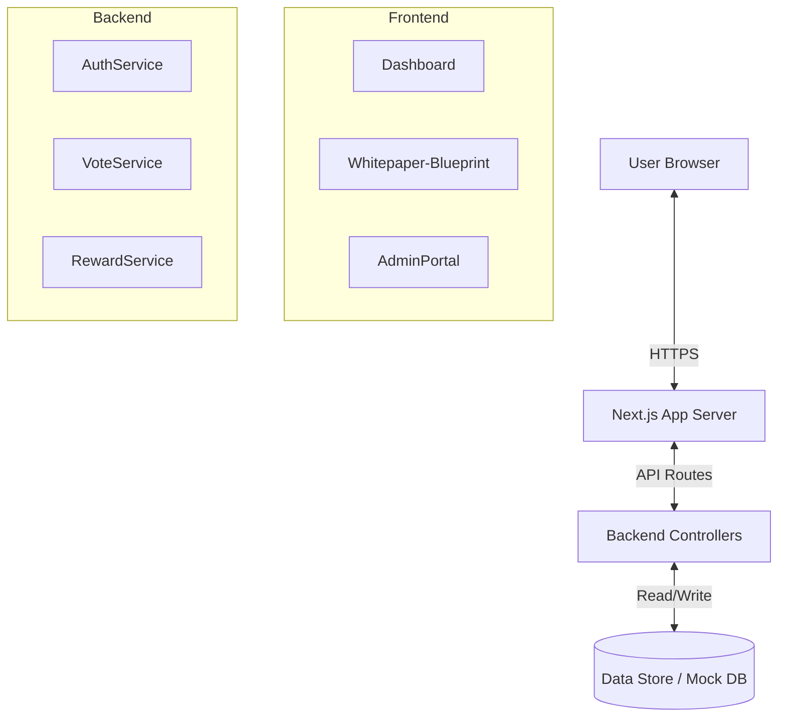

# Software Requirements Specification (SRS)
## Project: EmPulse
**Version:** 1.0 (MVP)

## 1. Introduction
This document defines the technical specifications, architecture, and data models for the EmPulse application.

## 2. Tech Stack
-   **Frontend:** Next.js 14 (App Router), React, Tailwind CSS (optional utility), Custom CSS Variables.
-   **Backend:** Next.js API Routes (Serverless).
-   **Database:** (Mocked for MVP) In-memory / LocalStorage / JSON file simulation.
-   **Authentication:** JWT-based (simulated) with Role-Based Access Control (Admin/User).
-   **Hosting:** Vercel.

## 3. System Architecture
### 3.1 High-Level Diagram


## 4. Data Models

### 4.1 User
```typescript
interface User {
  id: number;
  fullName: string;
  email: string;
  avatar: string;
  role: 'admin' | 'employee';
  points: number;       // Points received (Redeemable)
  votingQuota: number;  // Points available to give
  department: string;
}
```

### 4.2 Vote (Transaction)
```typescript
interface Vote {
  id: number;
  fromUser: User;
  toUser: User;
  message: string;
  timestamp: string;
  points: number; // e.g., 10
}
```

### 4.3 Reward Item
```typescript
interface Reward {
  id: number;
  name: string;
  cost: number;
  image: string;
  description: string;
}
```

### 4.4 Order
```typescript
interface Order {
  id: number;
  userId: number;
  rewardId: number;
  status: 'pending' | 'approved' | 'rejected' | 'completed';
  date: string;
}
```

## 5. API Endpoints
### 5.1 Auth
-   `POST /api/auth/login`: Authenticate user credentials.

### 5.2 Votes
-   `GET /api/votes`: Retrieve recent votes (Feed).
-   `POST /api/votes`: Send a new vote.

### 5.3 Rewards
-   `GET /api/rewards`: List catalog items.
-   `POST /api/orders`: Create a redemption request.

### 5.4 Admin
-   `GET /api/admin/orders`: List all pending orders.
-   `PUT /api/admin/orders/[id]`: Approve/Reject order.

## 6. UI/UX Specifications
-   **Theme:** Dark Mode default (`#000`, `rgba(255,255,255,0.05)`).
-   **Primary Color:** Neon Green (`#00D264`).
-   **Typography:** Satoshi / Inter.
-   **Responsive:** Mobile-friendly layouts for Feed; Desktop-first for Admin.

## 7. Security
-   **RBAC:** Admin routes (`/dashboard/admin/*`) protected by role check middleware.
-   **Validation:** Input sanitization on Vote messages (min 20 chars).
